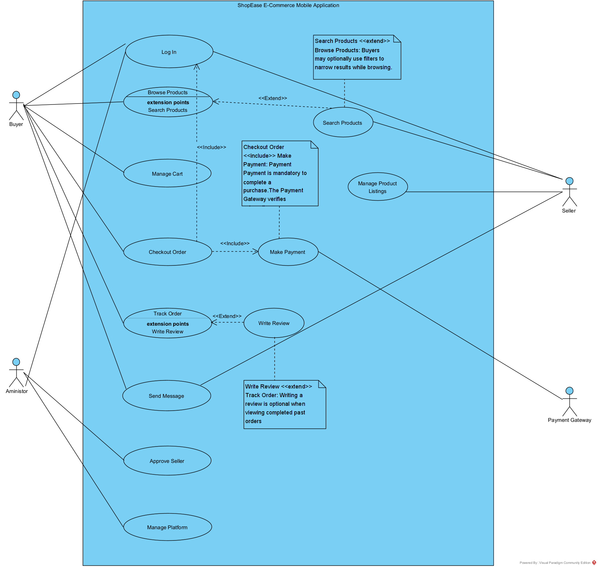
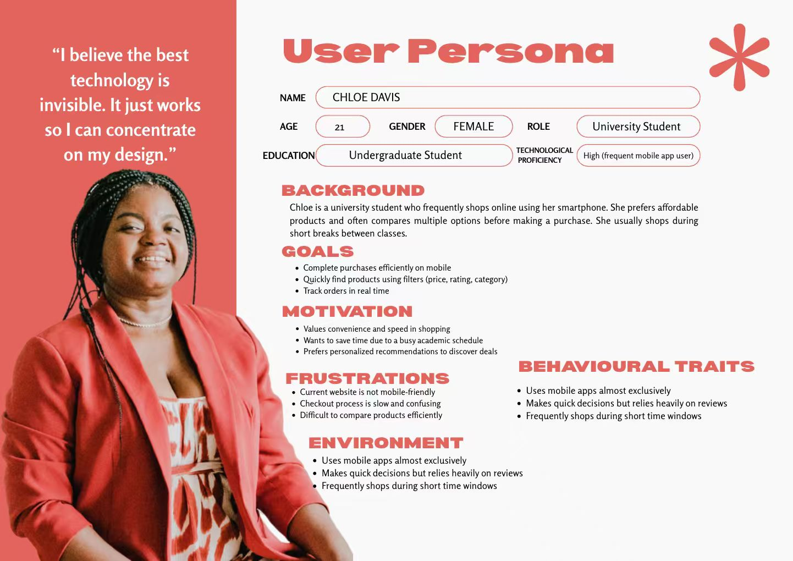
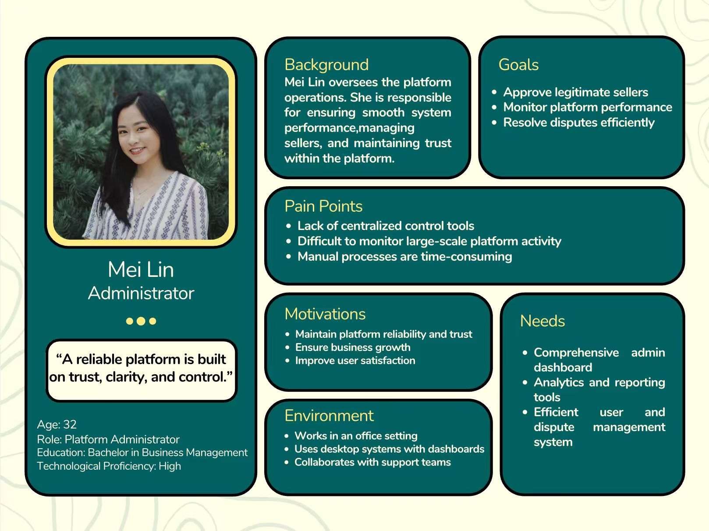
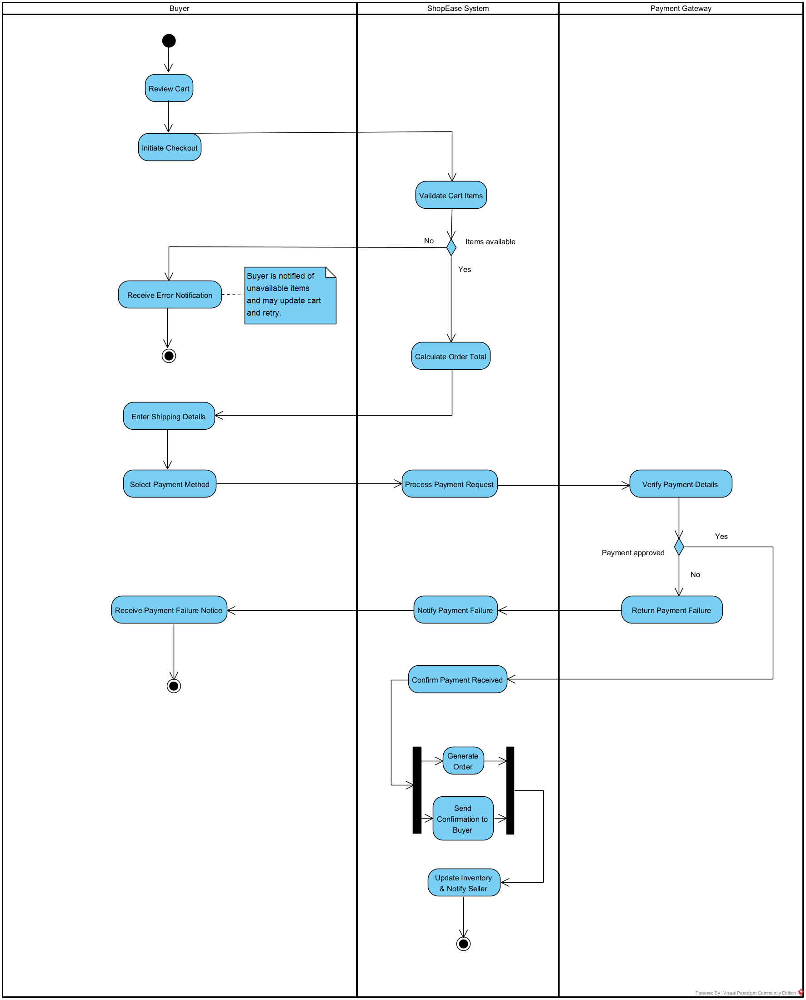
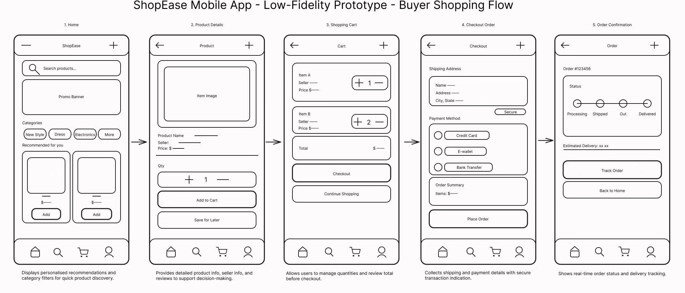

# COMP1035 Software Engineering — Coursework 1

## ShopEase E-Commerce Mobile Application: Requirements & Specifications Report

---

## Table of Contents

- [Part A: User Requirements](#part-a-user-requirements)
  - [1. Textual Analysis](#1-textual-analysis)
    - [1.1 Actors](#11-actors)
    - [1.2 Use Cases](#12-use-cases)
  - [2. Use Case Diagram](#2-use-case-diagram)
  - [3. Personas](#3-personas)
- [Part B: System Requirements (Specifications)](#part-b-system-requirements-specifications)
  - [4. Activity Diagram](#4-activity-diagram)
  - [5. Low-Fidelity Prototype](#5-low-fidelity-prototype)
- [Notes, Queries & Assumptions](#notes-queries--assumptions)

---

## Part A: User Requirements

### 1. Textual Analysis

The following textual analysis identifies the key actors and use cases extracted from the ShopEase requirements brief. Each candidate is supported by extracted text from the brief and a description that clarifies its role or function within the system.

#### 1.1 Actors

| Actor | Extracted Text | Description |
|-------|---------------|-------------|
| **Buyer** | *"...allow buyers to browse products, filter by categories, read reviews, make secure payments, and track orders in real time."* | End-users who register, search for products, make purchases, write reviews, and track deliveries through the mobile application. |
| **Seller** | *"Sellers will have access to a dashboard to manage inventory, process orders, and communicate with customers."* | Independent business owners who register as sellers, manage product listings, fulfil orders, communicate with buyers, and access sales analytics. |
| **Administrator** | *"The platform administrator, representing ShopEase, has the responsibility of overseeing the entire ecosystem."* | ShopEase operations staff responsible for approving sellers, resolving disputes, managing categories and promotions, and monitoring platform performance. |
| **Payment Gateway** | *"The app... make secure payments"* (external system) | An external payment processing system that verifies and processes buyer transactions securely. The Payment Gateway is outside the system boundary. |

> **Rationale:** We identified four actors because the brief clearly describes three distinct human roles (Buyer, Seller, Administrator) with different permissions and goals. The Payment Gateway is modelled as an external system actor because payment processing is handled outside ShopEase, similar to how the HPMS example treats its external payment system.

---

#### 1.2 Use Cases

| Use Case | Extracted Text | Description |
|----------|---------------|-------------|
| **Register Account** | *"They need to be able to register and log in securely..."* / *"They need to register as sellers and maintain their profile information."* | A process where Buyers or Sellers create an account by providing personal information, email, and password. Sellers provide additional business verification details. |
| **Log In** | *"They need to be able to register and log in securely..."* | All users (Buyer, Seller, Administrator) authenticate via secure login to access role-specific features of the application. |
| **Browse Products** | *"The app will allow buyers to browse products, filter by categories..."* | Buyers explore the product catalogue by scrolling through listings, viewing categories, and discovering promoted or recommended items. |
| **Search Products** | *"...search for products using various filters such as category, price range, and customer ratings..."* | Buyers refine product discovery using search keywords and filters. This optionally extends Browse Products when the buyer wants more specific results. |
| **Manage Cart** | *"...they should be able to add them to a shopping cart..."* | Buyers add, update quantities, or remove items from their shopping cart before proceeding to checkout. |
| **Checkout Order** | *"...proceed through a secure checkout process."* | The process where a Buyer confirms their cart, enters shipping details, and completes a purchase. This always includes the Make Payment use case. |
| **Make Payment** | *"...make secure payments..."* | A Buyer submits payment details which are processed through the external Payment Gateway. This is included as a mandatory step within Checkout Order. |
| **Track Order** | *"...buyers will want to track their orders in real time..."* | Buyers view the live status of their orders (confirmed, processing, shipped, delivered) after completing a purchase. |
| **View Order History** | *"...view their order history."* | Buyers access a record of all past orders, including details, dates, and statuses. |
| **Write Review** | *"...view detailed product information including images and reviews."*  | Buyers leave ratings and written reviews for products they have purchased. This optionally extends View Order History. |
| **Receive Notifications** | *"...notify them of relevant promotions based on their browsing and purchase behavior."* | The system sends personalised product recommendations and promotion alerts to Buyers based on their activity. |
| **Manage Product Listings** | *"The system should allow them to easily add new products, update existing listings, and remove items that are no longer available."* | Sellers add new products with images, descriptions, and pricing; update existing listings; or remove discontinued items from the catalogue. |
| **Process Orders** | *"Sellers must also be able to view and manage incoming orders, update order statuses..."* | Sellers view incoming orders, confirm them, update fulfilment status, and manage shipping for buyer purchases. |
| **Send Message** | *"...communicate directly with buyers through an in-app messaging system."* | Both Buyers and Sellers use an in-app messaging feature to communicate about orders, product enquiries, or issues. |
| **View Sales Analytics** | *"...the application should provide access to sales reports and analytics, showing trends in revenue, popular products, and customer activity."* | Sellers access a dashboard showing revenue trends, best-selling products, and customer engagement metrics. |
| **Approve Seller** | *"The administrator needs tools to approve new seller registrations, ensuring that only legitimate businesses join the platform."* | The Administrator reviews and approves or rejects new seller registration applications based on verification criteria. |
| **Resolve Disputes** | *"They must monitor platform activity to identify and resolve disputes between buyers and sellers..."* | The Administrator investigates and mediates conflicts between Buyers and Sellers, such as refund requests or order disagreements. |
| **Manage Categories** | *"...have the ability to manage product categories..."* | The Administrator creates, edits, or removes product categories to organise the marketplace catalogue. |
| **Create Promotions** | *"...create promotional campaigns..."* | The Administrator designs and launches platform-wide promotional campaigns and discount events. |
| **View Platform Reports** | *"...the administrator requires access to comprehensive reports on platform performance, including user growth, sales volume, and system health..."* | The Administrator accesses high-level reports on key performance indicators including user growth, sales volume, and system health. |
| **Configure Settings** | *"...configure platform settings."* | The Administrator adjusts platform-wide settings such as commission rates, notification rules, and security policies. |

> **Rationale:** Use cases follow the verb-noun naming convention as recommended. We distinguished Checkout Order and Make Payment as separate use cases connected by an <<include>> relationship because the brief emphasises secure payments as a critical feature involving an external system. Similarly, Search Products extends Browse Products because filtering is an optional enhancement to the browsing experience.

---

### 2. Use Case Diagram

The use case diagram below represents the functional requirements of the ShopEase mobile application. It identifies four actors (Buyer, Seller, Administrator, and the extenal Payment Gateway system) and their interactions with the system's core use cases.

**Key relationships:**
- **Checkout Order** <<include>> **Make Payment** — Processing payment is mandatory to complete any purchase, so this is an include relationship.
- **Search Products** <<extend>> **Browse Products** — Buyers may optionally use search filters while browsing; this is not required for every browsing session.
- **Write Review** <<extend>> **View Order History** — Writing a review is an optional action a buyer may take when reviewing past orders.

> **Note for Winston:** The Payment Gateway is placed outside the system boundary as an external system. We assume ShopEase will integrate with a third-party payment provider (e.g., Stripe, PayPal) rather than building payment processing in-house.

---

### 3. Personas

The following three personas represent the primary user types of the ShopEase application. Each persona is grounded in the requirements brief and designed to guide development decisions by capturing realistic goals, frustrations, and behavioural traits.

> **Rationale:** We created one persona per primary actor (Buyer, Seller, Administrator) to ensure that all user perspectives are represented. The personas reflect the brief's emphasis on mobile-first design for buyers, dashboard simplicity for sellers, and comprehensive oversight tools for administrators.

#### Persona 1: Chloe Davis — Buyer

**Connection to requirements:** Chloe directly represents the Buyer actor in the use case diagram. Her goals (browsing, secure checkout, real-time tracking, personalised recommendations) map to the use cases: Browse Products, Search Products, Manage Cart, Checkout Order, Track Order, View Order History, and Receive Notifications. Her frustration with the current website validates Mei Lin's vision for a dedicated mobile application.

---

#### Persona 2: Jonathan Patterson — Seller

**Connection to requirements:** Jonathan represents the Seller actor. His goals (managing listings, processing orders, communicating with buyers) map to the use cases: Manage Product Listings, Process Orders, View Sales Analytics, and Send Message. His moderate tech proficiency reinforces the brief's requirement that the system must be user-friendly with minimal training.

---

#### Persona 3: Mei Lin — Administrator

**Connection to requirements:** Mei Lin represents the Administrator actor. Her goals (approving sellers, resolving disputes, monitoring KPIs, managing promotions) map to the use cases: Approve Seller, Resolve Disputes, Manage Categories, Create Promotions, View Platform Reports, and Configure Settings. Her need for comprehensive reporting aligns with the brief's emphasis on strategic decision-making.

---

## Part B: System Requirements (Specifications)

### 4. Activity Diagram

The activity diagram below models the **"Checkout Order"** use case, which was selected because it is one of the most critical and complex workflows in the ShopEase application. This use case involves all three swimlane participants (Buyer, ShopEase System, and Payment Gateway), includes decision points, parallel activities, and integrates with the Make Payment use case via the <<include>> relationship identified in the use case diagram.

**Rationale for choosing Checkout Order:**
- It is central to ShopEase's core business function (completing purchases).
- It involves multiple actors across the system boundary (Buyer, System, and the external Payment Gateway).
- It demonstrates decision logic (item availability, payment approval/failure).
- It includes parallel processing (generating the order and sending confirmation simultaneously).
- It connects clearly to the use case diagram (Checkout Order <<include>> Make Payment).

**Key elements of the activity diagram:**
- **Swimlanes** separate responsibilities: the Buyer provides input and decisions, the ShopEase System handles validation and processing, and the Payment Gateway verifies payment.
- **Decision nodes** handle two conditional branches: whether cart items are available, and whether payment is approved.
- **Fork and join bars** model parallel activities after payment confirmation — the system simultaneously generates the order record and sends a confirmation notification to the buyer.
- **Initial and final nodes** clearly mark the start and end of the process.

> **Query for Winston:** Should the system allow partial checkout if only some cart items are available, or should all items be validated before proceeding? The current diagram assumes all-or-nothing validation.

> **Assumption:** We assume that if payment fails, the buyer is notified and can retry with a different payment method. The retry logic is referenced as a separate "Make Payment" activity to avoid overcomplicating this diagram.

---

### 5. Low-Fidelity Prototype

The low-fidelity prototype below illustrates the **Buyer shopping flow**, covering the use cases: Browse Products → View Product Details → Manage Cart → Checkout Order → Order Confirmation (with Track Order). This flow was chosen because it represents the primary user journey through the application and aligns directly with Mei Lin's vision of a modern, intuitive shopping platform.

**Rationale for choosing this flow:**
- It covers the end-to-end buyer experience, which is the most important user journey for ShopEase.
- It demonstrates the mobile-first design that Mei Lin specifically requested (no spreadsheets, no basic forms).
- It integrates multiple use cases from the use case diagram into a cohesive visual narrative.
- It connects directly to the activity diagram: screens 3–5 (Cart → Checkout → Confirmation) mirror the Checkout Order activity flow.

**Key design decisions:**
- **Screen 1 (Home):** Personalised recommendations and promotional banners address the brief's requirement for personalised product recommendations and promotions. Category chips provide quick filtering.
- **Screen 2 (Product Details):** Includes seller information, customer reviews, star ratings, and a prominent "Add to Cart" button — covering the brief's requirement for detailed product information.
- **Screen 3 (Shopping Cart):** Displays quantity controls, pricing breakdown, and two clear call-to-action buttons. Meets Mei Lin's desire for an intuitive, not spreadsheet-like, interface.
- **Screen 4 (Checkout):** Shows shipping address, multiple payment options (credit card, e-wallet, bank transfer), and an order summary. The lock icon signals secure payment processing.
- **Screen 5 (Order Confirmation):** Provides order tracking status with a visual progress indicator, estimated delivery, and navigation options — addressing the real-time tracking requirement.

> **Note for Charon:** The bottom navigation bar is consistent across all screens, providing persistent access to Home, Search, Cart, and Profile. This follows modern mobile app conventions and keeps the user oriented at all times. Each annotation below the screens explains the design rationale.

> **Query for Mei Lin:** Does ShopEase plan to support multiple payment gateways (e.g., credit cards and e-wallets), or should we focus on a single payment provider initially? The prototype currently shows three options.

---

## Notes, Queries & Assumptions

### Notes
1. **Integration between diagrams:** The same actors (Buyer, Seller, Administrator) appear consistently across the textual analysis, use case diagram, personas, activity diagram, and prototype. For example, the "Checkout Order" use case appears in the textual analysis, is shown in the use case diagram with its <<include>> relationship to Make Payment, is modelled step-by-step in the activity diagram, and is visually represented in prototype screens 3–5.
2. **Scope of external systems:** The Payment Gateway is the only external system identified. Future iterations may include external notification services (push notifications, SMS) and shipping/logistics APIs.
3. **Persona diversity:** The three personas represent different geographies, age groups, tech proficiencies, and user goals to ensure the design caters to a diverse user base.

### Queries for the Client (Mei Lin)
1. Should sellers be required to provide business registration documents during the approval process, or is basic identity verification sufficient?
2. What payment gateways should be prioritised for the initial launch (e.g., Stripe, PayPal, local e-wallets)?
3. Is there a preferred dispute resolution process (e.g., automated refund rules, manual administrator review, or a combination)?
4. Should buyers be able to save multiple shipping addresses, or is a single default address sufficient for the first release?
5. Are there any specific sales analytics metrics that sellers have requested beyond revenue, popular products, and customer activity?

### Assumptions
1. **Authentication:** We assume the system will use email/password authentication with optional multi-factor authentication, as mentioned in the system qualities section of the brief.
2. **Payment processing:** All payments are handled by a third-party payment gateway; ShopEase does not process or store card details directly.
3. **Real-time tracking:** Order tracking data is updated by sellers when they change order statuses (e.g., shipped, delivered) rather than through GPS-based live tracking.
4. **Messaging scope:** The in-app messaging system supports text-based communication between buyers and sellers; file/image sharing may be a future enhancement.
5. **Platform language:** The initial release targets English-speaking users; multi-language support may be added in subsequent iterations.
6. **Notification delivery:** Push notifications are the primary delivery method for recommendations and promotions, as the brief focuses on the mobile application.
